# 📊 Smart Dataset Analyzer

An end-to-end Data Analysis and Machine Learning web application built with Flask, Pandas, Scikit-Learn, Matplotlib, and Seaborn.

This platform allows users to upload datasets, analyze data, handle missing values, generate visualizations, perform statistical analysis, and automatically train machine learning models without writing code.

---

## 🎥 Project Demo

[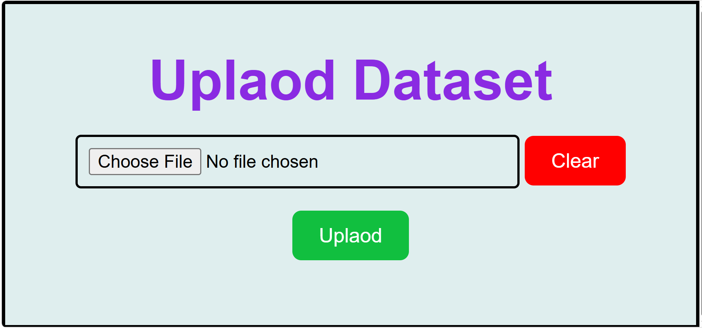](https://youtu.be/ulhbAIGRqPM)

---

Live Demo

🚀 Live Application: https://smart-dataset-analyzer-app.onrender.com

---

## 🚀 Features

### 📁 Dataset Upload
- Upload CSV datasets
- Automatic dataset loading
- Quick dataset preview

### 📋 Dataset Information
- First rows preview
- Dataset shape
- Dataset description
- Data types information
- Missing values analysis

### 🧹 Missing Value Treatment
- Detect missing values automatically
- Numerical columns:
  - Mean Imputation
  - Median Imputation
- Categorical columns:
  - Mode Imputation
- Download cleaned dataset

### 📈 Statistical Analysis
- Mean
- Median
- Mode
- Summary Statistics

### 📊 Data Visualization
#### Single Column Analysis
- Histogram
- Pie Chart
- Bar Chart
- Box Plot

#### Relationship Analysis
- Scatter Plot
- Line Chart

#### Dataset Analysis
- Correlation Heatmap
- Correlation Matrix
- Missing Value Analysis

### 🤖 Machine Learning
Automatically detects problem type and trains machine learning models.

Supported Models:

#### Regression
- Linear Regression

#### Classification
- Logistic Regression
- Decision Tree
- Random Forest

### 📉 Prediction Results
- Model Evaluation
- Best Model Selection
- Prediction Comparison
- Actual vs Predicted Values

---

# 🖼️ Application Workflow

```text
Upload Dataset
        ↓
Dataset Information
        ↓
Missing Value Detection
        ↓
Missing Value Treatment
        ↓
Statistical Analysis
        ↓
Data Visualization
        ↓
Machine Learning Training
        ↓
Prediction Results
```

---

# 📸 Screenshots

## Upload Dataset


---

## Dataset Overview

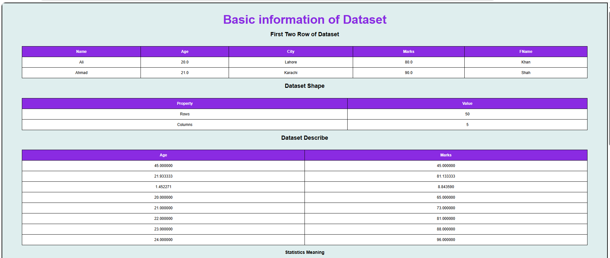
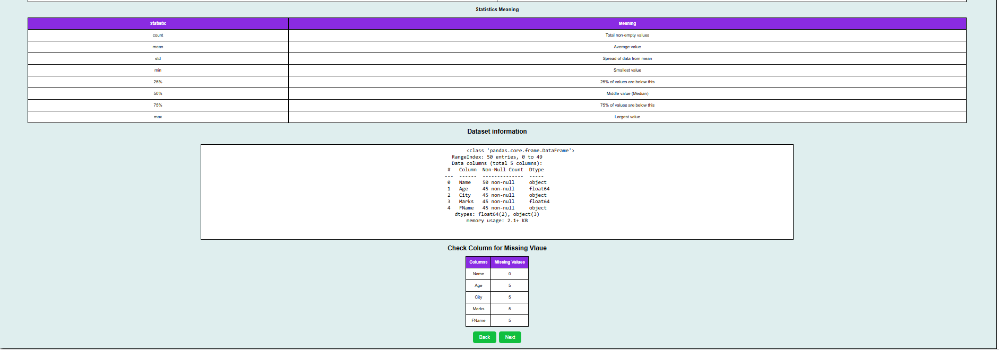

---

## Missing Value Detection

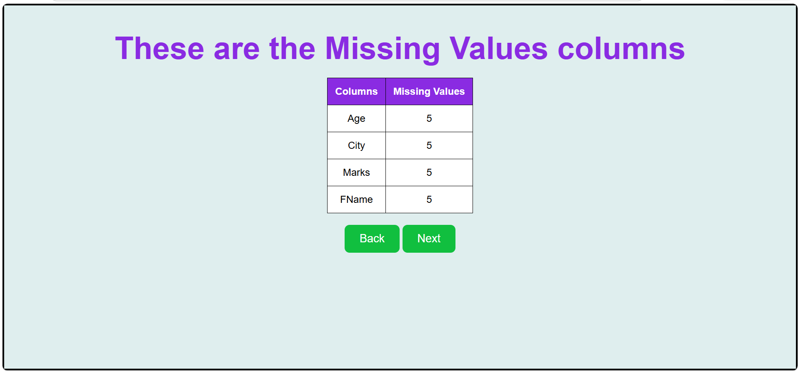

---

## Missing Value Treatment

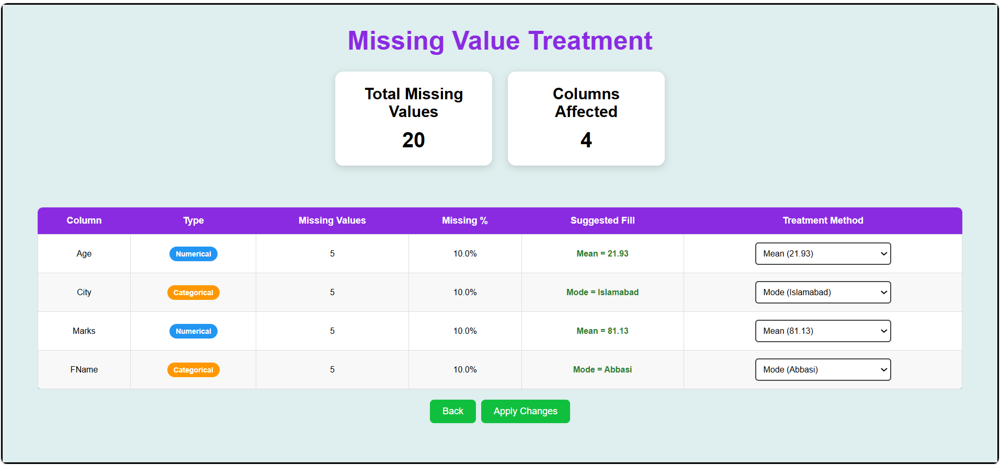

---

## Cleaned Dataset

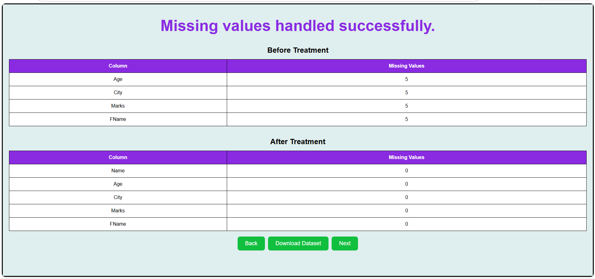

---

## Types of Columns

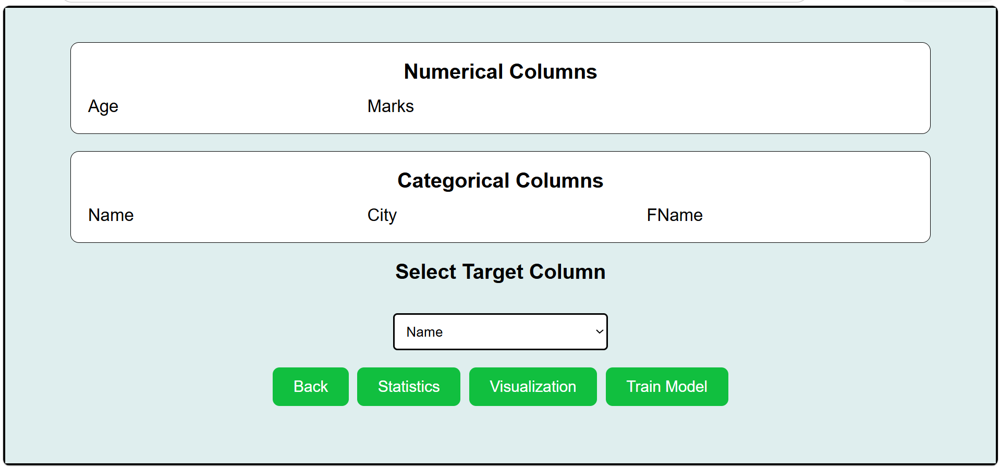

---

## Statistical Analysis

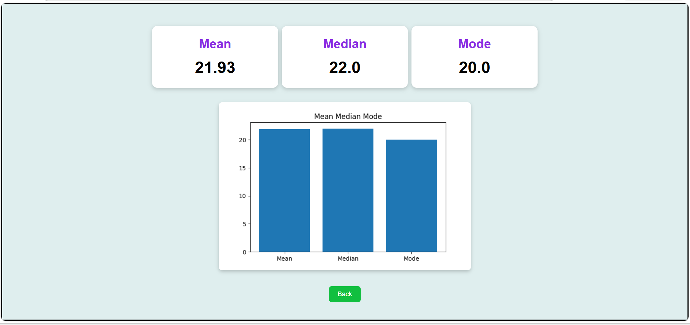

---

## Visualization Dashboard

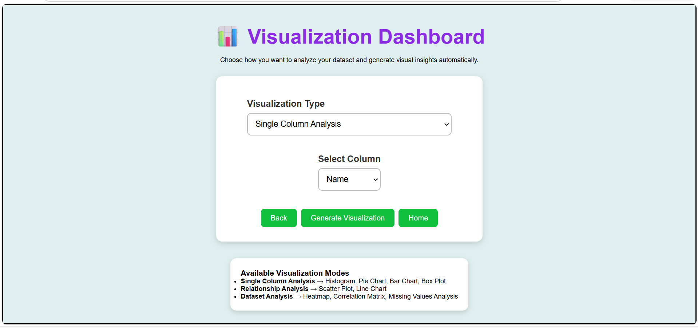

---

## Correlation Heatmap

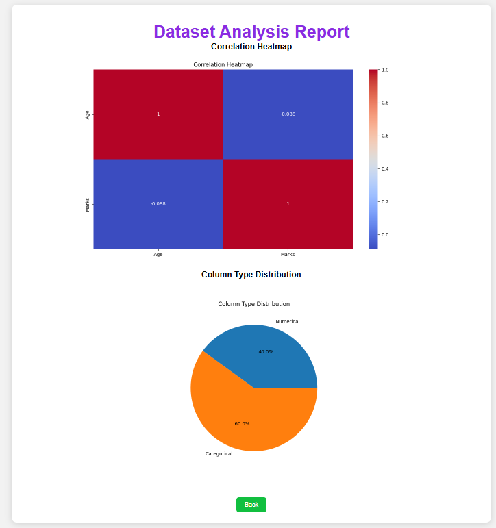

---

## Histogram Analysis

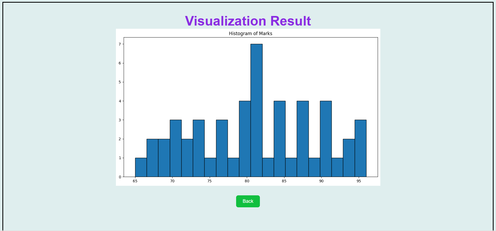

---

## Horizontal Bar Chart

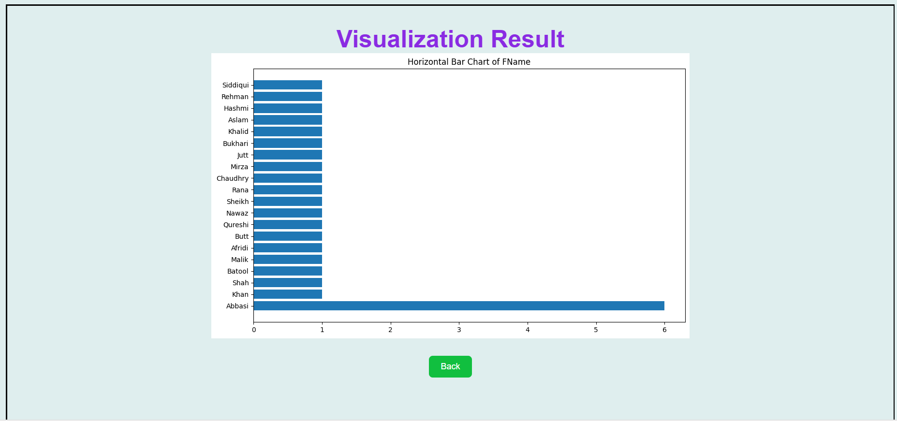

---

## Scatter Plot Analysis

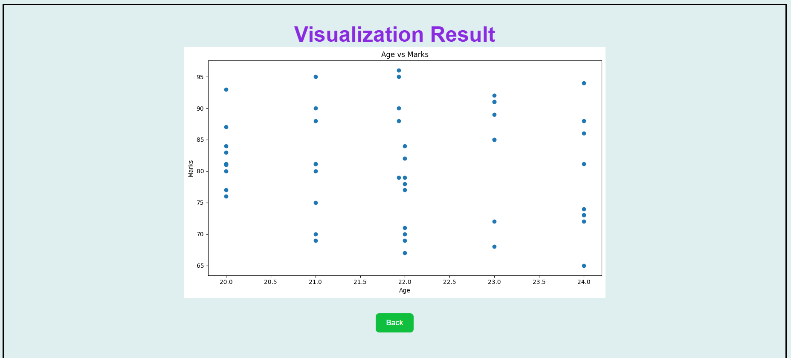

---

## Machine Learning Results

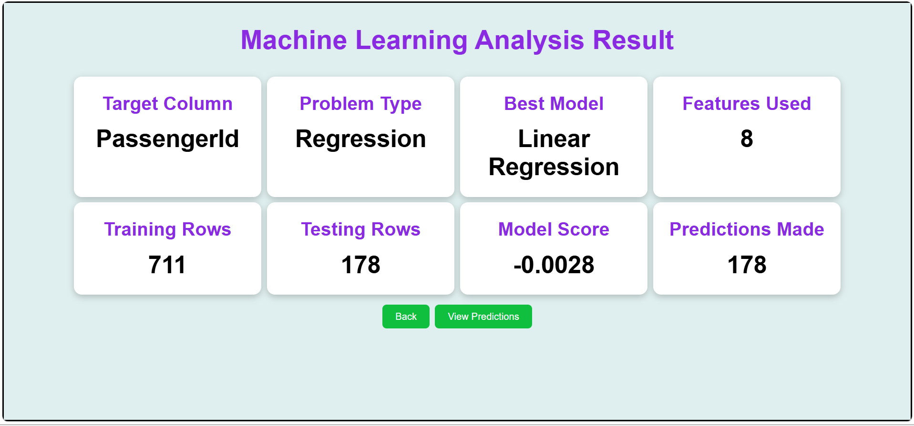

---

## Prediction Results

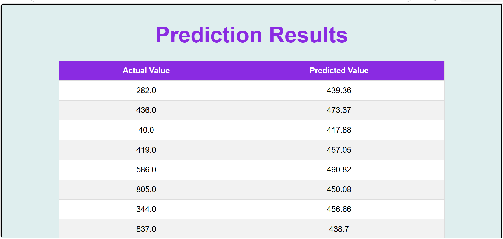

---

# 🛠️ Technologies Used

### Backend
- Python
- Flask

### Data Processing
- Pandas
- NumPy

### Machine Learning
- Scikit-Learn

### Data Visualization
- Matplotlib
- Seaborn

### Frontend
- HTML
- CSS
- JavaScript

---

# ⚙️ Installation

Clone the repository:

```bash
git clone https://github.com/yourusername/Smart-Dataset-Analyzer.git
```

Move into project directory:

```bash
cd Smart-Dataset-Analyzer
```

Install dependencies:

```bash
pip install -r requirements.txt
```

Run application:

```bash
python app.py
```

Open browser:

```text
http://127.0.0.1:5000
```

---

# 📂 Project Structure

```text
Smart-Dataset-Analyzer/
│
├── static/
│   ├── css/
│   ├── images/
│
├── templates/
│
├── uploads/
│
├── screenshots/
│
├── app.py
├── requirements.txt
└── README.md
```

---

# 🎯 Future Improvements

- User Authentication
- Excel File Support (.xlsx)
- PDF Report Generation
- XGBoost Integration
- KNN Classification
- SVM Classification
- Model Comparison Dashboard
- Interactive Charts (Plotly)
- Dark Mode UI
- Cloud Deployment

---

# 🌟 Why This Project?

This project simplifies the complete data science workflow for beginners, students, and analysts by combining:

- Data Cleaning
- Data Analysis
- Data Visualization
- Machine Learning

into a single web application.

---

# 👨‍💻 Author

**Alamgir Khan**

GitHub: https://github.com/AlamgirKhan48692

---

## ⭐ If you find this project useful, consider giving it a star.
